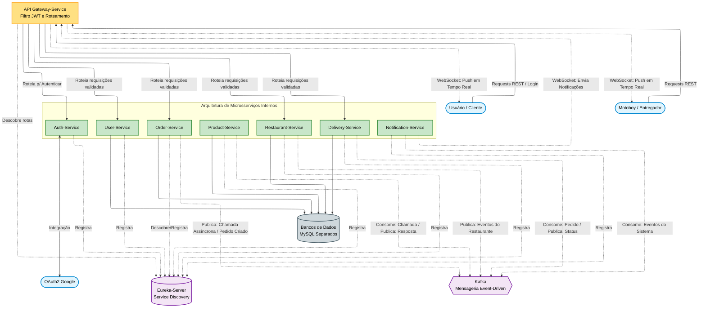

#  Food Delivery System - Microservices

Um sistema de entrega de comida desenvolvido com **arquitetura de microsserviços** utilizando **Spring Boot** e diversas tecnologias do ecossistema Cloud.  

---

##  Tecnologias utilizadas

- **Java 21**
- **Spring Boot**
  - Spring Web
  - Spring Security
  - validation
  - lombok
  - sping data JPA 
  - JWT
  - OAuth2 Client
- **Spring Cloud**
  - Eureka (Service Discovery)
  - API Gateway
- **Mensageria**
  - Kafka
- **Comunicação em tempo real**
  - WebSocket
- **Banco de Dados**
  - Mysql
- **JUnit & Mockito** → Testes unitários 
- **Docker** 
---

## Arquitetura

O sistema segue uma arquitetura de microsserviços, composta por:

- **Auth-Service** → Responsável por autenticação e autorização (JWT + OAuth2).
- **User-Service** → Gerenciamento de usuários.
- **Product-Service** → Cadastro e atualização de produtos (API interna).
- **Order-Service** → Criação e gerenciamento de pedidos.
- **Delivery-Service** → API dos motoboys, responsável por pegar pedidos, atualizar status e finalizar entregas.
- **Notification-Service** → Responsável por enviar notificações entre microsserviços e para os usuários.
- **Restaurant-Service** → Cadastro e gerenciamento de restaurantes.
- **Shared-Files** → Módulo compartilhado contendo DTOs e Enums comuns.
- **Gateway-Service** → Porta de entrada da aplicação e filtro de validação JWT.
- **Eureka-Server** → Registro e descoberta de microsserviços.

---

##  Autenticação

- Login e registro via **JWT**.
- Integração com **OAuth2 (Google)**.
- Validação centralizada no **API Gateway**.

---

##  Fluxo principal

1. O usuário se autentica no **Auth-Service**.  
2. Os pedidos são criados no **Order-Service**, que consulta o **Product-Service**.  
3. As mensagens entre os serviços são trocadas via **Kafka**.  
4. O acompanhamento do pedido em tempo real é feito por **WebSocket**.  
5. O **Delivery-Service** organiza a entrega.  
